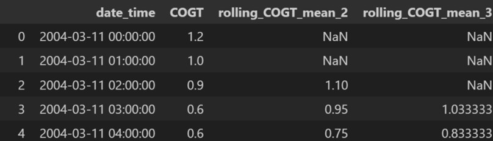

# Modeling Approach and Result Documentation

## Introduction
To ensure that our modeling approach can operate in a real-time environment, we need to design the pipeline to integrate with Kafka's streaming architecture. Therefore, feature engineering will be the most important aspect that we need to consider whether it can be implementable in real-time situations. 

---

## Feature Engineering Technique

1. **Time-based features**  
    Based on the timestamp provided in the dataset, we extracted several time-based features to help the model learn patterns related to time. These include:
    - Hour of the day to capture daily cycles
    - Day of the week to capture weekly cycles
    However, we cannot perform the monthly features because it will not be implementable in the real-time environment. This happens because the training dataset only contains the data from March to October. If the real data happens during November to February, the model will not know the pattern during that period. This leads to the decision not to develop the monthly feature to capture the yearly cycle.
2.	**Lagged features**  
    Based on the features provided in the dataset, we extracted several lagged features to represent pollutant values from previous time steps and are essential for capturing temporal dependencies. Specifically, we generated lag features for each pollutant variable up to 24 previous periods (hours). This allows the model to learn from a full day historical data when making predictions.
3.	**Rolling statistics features**  
    Based on the features provided in the dataset, we extracted several rolling statistics features both mean and standard deviation to help smooth out short-term noise and highlight consistent patterns over recent time windows.
    - Rolling Mean: The average value over a specified window up to 24 previous periods. This helps the model recognize local trends in the data.
    - Rolling Standard Deviation: Measures the variability of pollutant levels within the window. This feature is useful for identifying periods of high volatility or instability in air quality.
    To ensure that data leakage is prevented during model training, rolling features are created by shifting the data forward in time. This means that, at any given timestamp, the model only has access to information from the past—never from the future. For example, the features to predict the data at 2004-03-11 02:00:00 will use the average from 2004-03-11 00:00:00 to 2004-03-11 01:00:00.
    
4.	**Scaling features**  
    To ensure that all features are on the same scale and to improve the performance of models sensitive to feature magnitude, we applied StandardScaler to all features used in linear models. 
*Scaling model for each pollutant will be saved as pickle files so that the same scaling method can be used in consumer.py when we predict the test dataset.
5.	**Column Ordering**  
    To ensure that all features are stored according to the train dataset, we export list of column of the train dataset in json files. These files will be use when we predict the test dataset in consumer.py

---

## Modeling Technique
Based on the insights gained during the EDA process, we scope down models that are well-suited for time series forecasting and capable of capturing the linear relationships between variables, temporal dependencies, and seasonal patterns in the data. In addition to selecting advanced models, we also introduced a baseline model and a challenger model to benchmark performance.
    - The baseline model relies on a simple model, we will use Simple Linear Regression as our based-line model.
    - The challenger models include:
        - Linear Regression with Elastic Net: capture linear relationship, temporal dependencies and prevent multicollinearity.
        - Light Gradient Boosting Machine (LightGBM): complex non-linear relationships and interactions between features.
        - SARIMA: capture seasonality, trend, and autocorrelation in time series data.

---

## Evaluation Methodology

Each model was evaluated using two standard regression metrics:
    - Mean Absolute Error (MAE): Measures the average magnitude of errors in predictions, providing an interpretable unit-level error.
    - Root Mean Squared Error (RMSE): Penalizes larger errors more heavily than MAE, making it useful for detecting models that perform poorly on extreme values.
However, if there are conflicts between these two metrics, we will select the best model based on RMSE because it penalizes larger errors more heavily.

---

## Model Result (Validation Dataset)

Based on the evaluation table in validation dataset, the best-performing model is Linear Regression with Elastic Net, which achieved the lowest MAE and RMSE among all challenger models. Therefore, this model was selected for deployment. It was exported as a pickle file, allowing the consumer.py script to load the trained model and perform real-time predictions on incoming test data from the Kafka stream.

